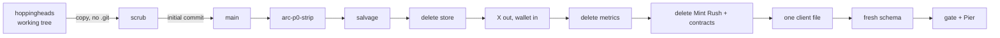
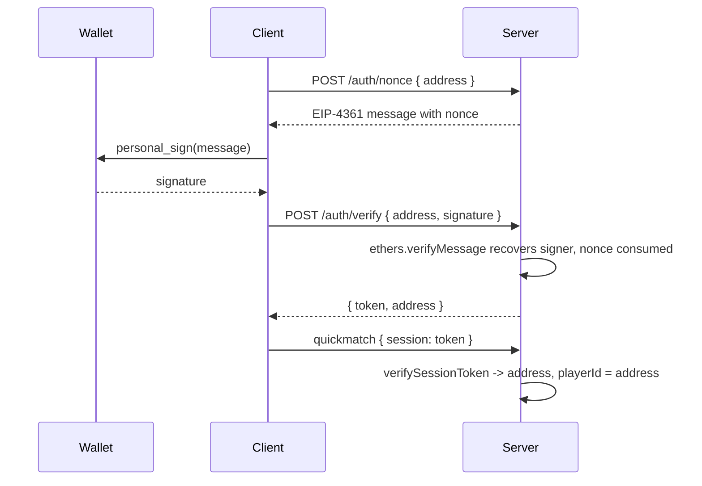
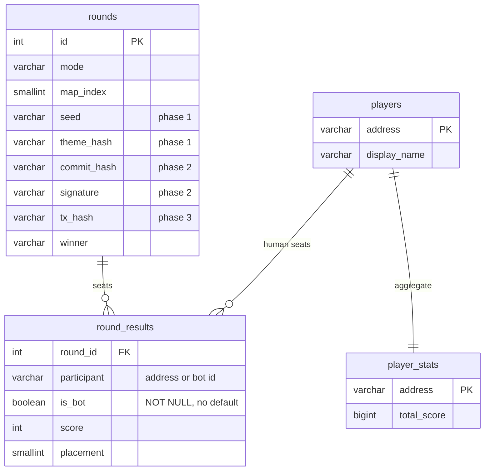

# Phase 0: stand up, strip, re-gate

This repo was seeded from the `hoppingheads` working tree as a file copy, never a clone. The source history holds secrets and this repo goes public at submission, so history starts at the scrubbed initial commit. Everything below happened on `arc-p0-strip`.



## 1. Seed and scrub

Copied without `.git`, `node_modules`, `artifacts/`, `cache/`, `typechain-types/`, `.lint-tmp/` and every `.env*`. Then grepped for every class of secret the brief named, before `git init` existed.

<details>
<summary>Full hit list and what happened to each</summary>

| Hit | Where | Action |
|---|---|---|
| Scrambled admin route `/hq/...` | `server/src/index.js` fallback literal | Structural, so the feature went: the four admin routes, `admin.html`, `store-admin.html`, `workshop.html`, `metrics.html` |
| Railway hostname `hoppingheads.up.railway.app` | `index.js` ALLOWED_ORIGINS, `METRICS_INTEGRATION.js`, `migration.sql` | Removed from origins; both files deleted |
| Real Twitter user id | `body.json` | Deleted |
| Empty stray file | `console.log(t.length))` | Deleted |
| Five Cloudflare-obfuscated contact emails | `terms.html`, `privacy.html` | Replaced with `[contact email]`. `privacy.html` was truncated mid tag in the source; closed |
| Personal X handle | `landing/index.html` meta and body, both copies | Removed |
| Beta codes, seeded beta values | none found as literals; the tables and routes went in the strip | |
| Session secrets, OAuth ids, API keys, RPC URLs, DB URLs, private keys, mnemonics, deploy tokens | none as literals. Every one is `process.env.X` with no baked fallback, except the admin path above | |
</details>

Rescanned after edits: zero hits. The initial commit was gated (typecheck, lint, 14 tests, mirror in sync) and booted against a local Postgres with every route answering 200 before the repo was created, private.

## 2. Salvage

`server/src/game/mapGenerator.js` already had no imports and held `generateMap`, the theme system and `isInRange`. It stayed where it was. What needed extracting was the rule set inside `roundManager.js`, which carried a global round registry, `Date.now()` in every rule, and threw on failure.

**`server/src/game/collection.js`**, new, pure:

| Export | Rule, unchanged from the source |
|---|---|
| `discover(map, player, actorId, now)` | marks assets within 48 as discovered by actor |
| `beginMint(map, player, actorId, assetIndex, now)` | discovered, not taken, in range, under limit 10; locks the player; reports speed bonus eligibility (own find, within 2000ms) |
| `finishMint(map, player, actorId, now)` | waits the rarity duration (2000..7000ms) with 100ms grace; 1.2x if speed bonus; clears the lock if the asset was taken meanwhile |
| `contestMint(challenger, target, assetIndex)` | within 32, interrupts the target's lock |
| `scoreCollector`, `rankCollectors` | set bonus 1.5x at three of one tag, plus 5 per discovery, sorted with placement |
| `visibleAssets(map)` | fog of war projection |

Two plumbing changes and nothing else: the clock is a parameter, and failures return `{ ok:false, error }` rather than throwing. 19 tests pin both modules.

### What `generateMap` takes and returns

```
generateMap(hexSeed, themeOverride?)
  hexSeed        string, 0x prefixed hex. ONLY THE FIRST 8 HEX CHARS ARE USED.
                 Two seeds that differ past char 8 produce the same map. Phase 1
                 must choose the seed format with that in mind, or replace
                 seedFromHex with a full-width hash.
  themeOverride  one of THEME_KEYS, else picked from the seed

returns {
  seed, theme,
  mapWidth: 960, mapHeight: 600, tileSize: 16,
  zones[], paths[], trees[], structures[], water[],
  assets[{ index, x, y, rarity 0..4, rarityName, points, name, themeTag,
           discovered, discoveredBy, minted, mintedBy, tokenId }],
  assetCount 15..25
}
```

> **Coordinate space warning.** `generateMap` emits a 960 by 600 pixel 2D space with 16px tiles. The live client runs a 300 unit 3D map (`MAP=300`, positions in -150..150 on x and z). `collection.js` operates on whatever space the map's assets are in. Phase 1 either rescales the generator's output to the live map or regenerates positions in the live space; it cannot wire these together as is.

## 3. Deletions

Each group is one commit, and the server was booted against Postgres after each with the removed routes probed.

| Group | Gone | Boot check |
|---|---|---|
| Store, credits, `awardGameCredits` | `routes/store.js` (932 lines), store schema and seed, `store.html`, `initStoreDb`, the `player_loadout` join in `quickmatch`, MY ITEMS page and loadout code in the client (512 lines), both credits toasts, the credit payout in `/api/score` | `/store` 404, `/api/store/*` 404, `/api/score` 200 with no credit field |
| X OAuth, beta gate | `twitterAuth.js`, `beta.js`, `verifySession` and `hasPlaytestAccess` in the socket, the playtest gate HTML and `/play`, the X block and CONNECT X bar in the client, the playtest section and flow script on the landing page, the unserved root `landing/` copy | `/auth/twitter` 404, `/api/beta/check` 404, `/play` 404 |
| Metrics | `track.js`, `metrics.js`, `metrics-schema.sql`, `tracker.js`, the `hhTrack` IIFE and all 11 call sites, four reference files | `/api/track` 404 (GET and POST), `/api/metrics` 404, `/tracker.js` 404 |
| Friend matchmaking, invites, join codes | **Nothing to delete.** Zero hits for invite, friend, room code, join code or private lobby in the socket or the client. Matchmaking is `findOpenLobby()` only | |
| Mint Rush, contracts | `/api/auth/*`, `/api/rounds/*`, `/api/players/:wallet`, `utils/auth.js`, `roundManager.js`, `contractService.js`, `contracts/*.sol`, `hardhat.config.js`, `scripts/deploy.js`, `initContracts` | `/api/rounds/open` 404, `/api/players/x` 404, `/api/auth/nonce` 404, `/auth/nonce` 200, boot log free of CRITICAL lines |

Kept, as instructed: the `mint:done` scoring mechanic (its rarity-from-payload bug is a phase 1 fix), movement, hopping, boink, fragments, maps, audio, the cosmetic renderers, and the boink handler's server side proximity check.

<details>
<summary>One slip, caught before it landed</summary>

Removing the inline `hhTrack` calls with a `[^;]*` regex ran past one call and ate `}updateHud();` on the fragment collect line. Lint caught the resulting unbalanced `try`. The exact text was restored, then every hunk in that diff was checked mechanically: old text with tracker calls stripped must equal new text, and brace and paren counts must match. Nine hunks, all clean. It is in the metrics commit message too.
</details>

## 4. Wallet admission gate

X is out and the lobby was never gateless between commits: the removal and the replacement are one commit.



`server/src/utils/walletAuth.js`. No RPC, no contract, no chain call; signature recovery is pure math. Nonces are single use with a five minute TTL and a bounded store. Session tokens are HS256 over `SESSION_SECRET`, seven days. **Fails closed:** with no secret the auth routes answer 503, no token is ever issued, and `quickmatch` denies everyone.

`quickmatch` keeps its shape. The client-supplied name is discarded, the skin whitelist stays. `playerId` is the recovered address (lowercase `0x` + 40 hex), the display name is `shortAddress()` of it, and one address holds at most one seat across live lobbies. `POST /api/score` requires the same session and derives the name from it, so a guest cannot write a result row.

**Wallets are free.** The X account this replaces cost something to make; an address costs nothing. There can be no free entry tier that pays anything, or the game is a faucet. The stake is the sybil cost. Guests can play solo modes; they cannot take a lobby seat or land on the leaderboard.

Set `CHAIN_ID` for the chain named in the sign in message; it defaults to 1 and is informational until phase 2.

## 5. One client file

`client/index.html` is kept and served at `/game` directly. It was the source of truth in the old workflow (sync copied client to `server/public`, never the other way; lint reads `client/`; `check-sync`'s own error said "run npm run sync"). `server/public/` is gone. Verified: `GET /game/` bytes have the same md5 as the file. `check-sync` is removed, not ported.

## 6. Modes

Nothing is deleted here; this is the coupling map for the phase 1 call.

The server has **no mode concept at all**: one `mode` mention in `gameSocket.js` and it is the string written to `rounds.mode`. Lobbies are undifferentiated; the client decides what it is playing.

| LBS only (Last Head Hopping) | Classic only |
|---|---|
| 19 `gameMode==='lbs'` branches | 0 `gameMode==='classic'` checks: classic is the else branch everywhere |
| `lbsDifficulty`, `lbsAliveCount`, `lbsPlayerEliminated`, `lbsSpectating`, `lbsSpecTarget`, `lbsDecAlive` | `fragments`, `fragCounts`, `mintedCount`, `spawnNFT`, `unlockedNFTs`, `scatterFragsAt` |
| `lhsFx` (53 refs: bomb, quake, bouncy, ghost, shrink, slot), `lhsFirstKill`, `PW_LHS` | `PW_CLASSIC`, `radarPings`, `crownHeld`, `roundTime`, `getScoreRank`, `submitClassicScore` |
| `_health`, `showEnemyHP`, `_lbsAggro`, `_lbsNpcAggro` | `tutorialActive` (tutorial runs in classic) |
| `feverZone` doubles as the heal zone in LBS | |

Bot AI is one loop with an `if (gameMode==='lbs') ... else ...` split at `client/index.html` around the `Smart NPCs` comment. The emote wheel reads `_ownedEmotes`, which the store filled; it is empty until phase 1 decides the default set.

## 7. Schema



`rounds` keeps the source shape minus `onchain_id`. `is_bot` has no default so every writer must say it. `player_stats` is keyed by the full address; the source keyed it by display name, and two addresses can share a 12 char display form.

## 8. Participant ids

`server/src/game/ids.js`, four tests proving the spaces never overlap.

| Kind | Shape | Source |
|---|---|---|
| human | `^0x[0-9a-f]{40}$` | the recovered signer, lowercased, never client input |
| bot | `bot:<8 hex>:<n>` | seed prefix plus slot; not `0x`, contains colons, different length |

`botId(seed, n)` builds one. Nothing spawns bots yet.

## 9. Gate

```sh
npm run gate           # typecheck, lint, test, build
npm run typecheck      # node --check over every .js and .mjs source (parse level, no tsc here)
npm run lint           # ESLint bug rules over server/src and the inline client scripts
npm run test           # node --test over server/tests, 48 tests
npm run build          # served files present, server imports resolve, client scripts parse
npm run install-hooks  # pre-push hook that refuses a red gate
```

CI (`.github/workflows/gate.yml`) runs `npm ci --ignore-scripts` then the gate, then `git diff --exit-code` so nothing regenerates at check time.

## 10. Pier

`pier.json` registers `hh-arc` as a node service on port 7510 with `/api/health` as the health path. Env lives in Pier's store, never in the repo; `.env.example` lists the keys.

```sh
pier start hh-arc
open http://hh-arc.test:7080/game
pier logs hh-arc
```

No signer or settler service. Phase 3.

## 11. What cannot be confirmed headlessly

A green gate and 200s on every route prove the server serves the right bytes and the DB writes land. They prove nothing about play. Each of these needs a person:

| Claim | Manual check |
|---|---|
| The game is still playable and feels unchanged after the strip | Open `/game`, insert the coin, play a classic solo round to the end screen and an LBS round on each difficulty. Movement, hop, boink, fragment pickup, mint, fever, crown, spectate on elimination. Nothing should feel different; nothing here touched those paths. Console must stay free of ReferenceErrors |
| Nothing visual broke when the store and login UI came out | Main menu: no gap where MY ITEMS was, CONNECT WALLET bar renders in gold with no purple, no gradient, no coloured side bar. End screen renders the head, score, rank. Cycle skins on the cabinet |
| Wallet sign in completes in a browser | With a browser wallet installed: click CONNECT WALLET, approve the account request, sign the message (it must read as a sign in request with the site domain and say no transaction), see the bar switch to the short address. Reload: still signed in. PLAY ONLINE with a second wallet in a second browser: both join a lobby, the tick shows both, the round ends and `/api/leaderboard/recent` shows two rows under two addresses |
| The emote wheel | Expected to be empty. Phase 1 decision |

_(screenshot or clip of the menu with the wallet bar, and of a full round, goes here once someone runs it)_

## 12. Flagged rewrites over ten lines

All required by the brief, listed so review knows where to look:

- `gameSocket.js` `quickmatch` auth head (X to wallet) and the loadout join removal
- `gameSocket.js` `saveResults` (new tables)
- `api.js` `POST /score` (auth, payout removal, new tables) and both leaderboard readers
- `client/index.html` X block to wallet block; store code removal (512 lines)
- `scripts/git-hooks/pre-push` (21 to 11 lines, runs the gate)
- `Dockerfile` moved to the root (a `server/` build context cannot see `client/`)
- `README.md` rewritten; the old one was Railway and Base deployment steps
- `index.js` `ALLOWED_ORIGINS` default trimmed to localhost; the old default listed hoppingheads.fun and blocked socket.io from any other origin, including Pier

## 13. Left alone, worth knowing

- `terms.html` and `privacy.html` still describe X accounts, playtest codes and Railway in prose. Legal text for the old product; not a code change.
- Dead `.beta-*` CSS remains in the landing page.
- `MINT_LIMIT` is 10 in `collection.js` and `maxMints` is 5 in `gameSocket.js`. The source carried both. Phase 1 reconciles.
- dotenv 17 prints a promotional tip line on boot when no `.env` exists. Cosmetic.
- The `mint:done` handler still takes rarity from the payload. Phase 1.
