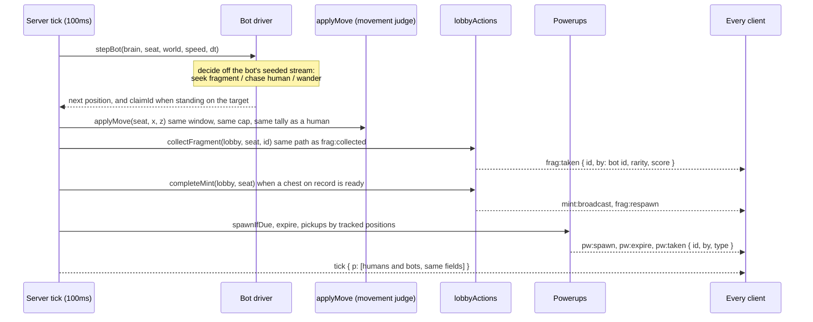

# Phase 2: server-side bots and server-side powerups

The server now drives bot participants on its own tick, and bots collect and mint through the same validated paths humans use. The server also spawns, places and resolves powerups, which is what lets the movement cap drop to base speed for anyone it does not know to be boosted. No chain code.



## Recon, and what it found

A lobby seat needs the fields read by the tick serialiser, the pos, collect, mint and boink paths, endRound and saveResults. Those fields now come from one factory, `createSeat()` in `server/src/game/bots.js`, so a human and a bot are the same shape by construction and a test asserts the keys match. `socketId: null` is safe: the only socket lookup driven by a seat is the boink target emit, already null-guarded. Two things assumed humans and were changed: `saveResults` wrote `is_bot false` unconditionally and upserted `player_stats` for every seat; the `disconnect` teardown only fired at `players.size === 0`, which a bot-filled lobby never reaches.

Powerups were client-local end to end: position off the seeded stream, type off `Math.random`, schedule and pickup in the render loop, nothing emitted. The client's own NPCs also ran during online rounds, marking fragments collected with no server claim and boinking the player with knockback the server never granted.

## Bots

<details>
<summary>Seat and spawner (<code>bots.js</code>)</summary>

```
createSeat({ id, name, address, socketId, appearance, index, isBot, maxMints })
createBotSeat(seedHex, n, index, maxMints)   id = bot:<seed[2..10]>:<n>, name "BOT n+1", no socket, no address
fillWithBots(lobby, seedHex, fillTo, maxSeats, maxMints)  fills to BOT_FILL_TO (env, default 4)
countSeats(players) -> { humans, bots }
```

Bots join at countdown, when the seed is now issued (moved there from round start so the ids can carry the run seed), and each is announced with `player:joined` like anyone else. A classic lobby starts its wait with a single human; the lobby is torn down when the last human leaves. `MODES.classic.bots` is true, `MODES.lbs.bots` false (LBS resolves eliminations on the client).
</details>

<details>
<summary>Driver (<code>botDriver.js</code>)</summary>

```
botStreamSeed(seedHex, slot)   the round seed with its last byte replaced by the slot
createBotBrain(seedHex, slot)  { rng, target, wait, decisions[] }
decide(brain, seat, world)     seek nearest unclaimed fragment within 60 (60%),
                               chase nearest human within 45 (25%), else wander;
                               sets a wait before the next decision
stepBot(brain, seat, world, speed, dt) -> { nx, nz, ry, moving, claimId }
                               walks at BOT_SPEED 14 (28 when the server knows it is boosted)
                               in real elapsed time, capped at 0.25s per tick, inside the map;
                               follows a targeted fragment if a respawn moves it, re-decides if
                               it is gone; claimId when within CLAIM_RANGE 2.5 of the target
```

`world` is `{ fragments: unclaimed [{id,x,z}], humans: [{x,z}] }`, rebuilt each tick and kept current within the tick after a claim or a mint. Decisions replay exactly from the seed; positions replay exactly at a fixed tick and drift with tick jitter live, because the movement judge runs on real time and the driver must too.

The driver never touches fragment state. Movement goes through `applyMove`, the same function the `pos` handler calls; a bot tripping the speed check is a driver bug, and the test drives four bots for 3000 jittered ticks under the base cap with zero flags.
</details>

<details>
<summary>Collection and mints (<code>lobbyActions.js</code>)</summary>

`collectFragment(lobby, seat, id, emit)` and `completeMint(lobby, seat, emit)` are the validated paths as functions of the lobby and the seat, not of a socket. The socket handlers call them for humans; the driver calls them for bots. `emit(event, payload, seat)` is the only side channel: with a seat it goes to that seat only (a rejection; a bot has no socket, so it is tallied, logged and sent nowhere), without one to the lobby (`frag:taken`, `mint:broadcast`, `frag:respawn`). A bot claiming out of range is rejected exactly as a human would be, asserted by running both and comparing result, tally, events and the untouched fragment.

Three driver flaws the rejection tally surfaced in the first live run (101 rejections) are fixed: chasing a fragment's old position after a respawn, two bots targeting one fragment in the same tick, and a capped bot retrying mints every tick. The third run had zero.
</details>

## Powerups

<details>
<summary>State shape and rules (<code>powerups.js</code>)</summary>

```
createPowerupState(seed, mapIndex, startedAt) -> {
  stream,        shared/layout.cjs createPositionStream(seed, map, 0.35): last seed byte 0xff
  active: Map    id -> { id, type, x, z, spawnedAt }
  nextId, nextSpawnAt, log: [[type, x, z]]
}
spawnIfDue(state, now)    first at 15s, then every 25s, at most 5 active; type and position off the stream
expire(state, now)        gone after 45s
pickups(state, seats, now) -> [{ id, type, by }]  first seat within 4 units, bots included;
                          seat.effects[type] = now + duration (speed 8s, magnet 12s, shield 2s)
hasEffect(seat, type, now)
```

There is no claim event. Proximity on the server, checked every tick against tracked positions, is the claim. The client builds a mesh on `pw:spawn`, runs its own local effect on `pw:taken` only when the server names it, and removes the mesh for anyone else's pickup or an expiry. Online classic the client's spawn timer and proximity check are off; solo and LBS powerups are unchanged and client side.

Effects that are purely visual stay on the client. The one the server must know, speed, is what the movement cap reads.
</details>

## The cap

`applyMove` uses `BOOST_SPEED` (36) while `hasEffect(seat, 'speed', now)`, else `BASE_SPEED` (18), then the grow penalty. `WINDOW_TOLERANCE` is 0.5 units per window, enough for the client's 0.1 position rounding, and does not grow with update rate.

| | first flagging multiplier |
|---|---|
| unboosted, rounded positions | **1.05x** (18.9 u/s) |
| server known boost | 2.05x |
| honest 18 u/s, rounded, arrival jitter 20/120, 10/10/10/10/310, 5/200 ms | 0 flags |
| bot at 14 u/s, jittered ticks | 0 flags |

Live, two humans and two bots: the seat at 27 u/s (1.5x) flagged on 79 of 80 updates from its first window; the seat at 18 and both bots had no `Flags` line. The phase 1b ceiling let anything under 2x through.

## Sessions

One human socket and bots, `LOBBY_WAIT_SECONDS=3`:

```
3.1s  player:joined bot:8977ee69:0 "BOT 1" count=4   (x3, ids carry rounds.seed 0x8977ee69..)
6.1s  round:start mode=classic map=5
      ... 76 frag:taken events, bot collectors; 13 mints; 3 pw:spawn, 1 pw:taken by the human, 1 pw:expire
66.2s round:end [["bot:..:0","BOT 1",207,1],["bot:..:1","BOT 2",182,2],["bot:..:2","BOT 3",109,3],[human,0,4]]
round_results: bot rows is_bot=t with score/minted/fragments 207/5/29, 182/5/34, 109/3/13; human is_bot=f
player_stats: one row, the wallet
server: zero REJECT lines, zero FLAG lines
```

The real client in headless Chromium, signed in and joined online: the three bots render from the tick alone, move on screen (10.8, 19.4 and 17 units in 6s), the client's local NPCs are not in the scene, the server's powerup is in the scene with its id and the client spawned none of its own, no page errors.

## Still client authoritative after this phase

- **Human position.** Tracked, judged and clamped, not simulated. No collision on the server; bots walk through walls too.
- **Boink damage, absorb, knockback resolution.** The server checks proximity, grants the knockback budget and forwards `boink:hit`; health and outcomes resolve on the client.
- **Powerup effects other than speed.** Shield, magnet and every LBS effect apply on the client. The server records shield and magnet windows but nothing reads them yet.
- **Fever zone, crown, stolen and scattered fragments.** Client side, unsynchronised, not scored online.
- **Solo rounds.** No lobby, no tick, no bots: the client's own NPCs and powerups, the client's own score. "Solo with bots" is one human in an online classic lobby.
- **LBS entirely.**

## What cannot be confirmed headlessly

A green gate proves bots move legally, claim only what the rules allow, and that the layouts and powerups match. It does not prove any of this is fun.

| Claim | Manual check |
|---|---|
| Bots look and feel like opponents, not drifting markers | PLAY ONLINE, classic, alone. Watch the three bots for a full round: they should head for fragments and take them (you see them vanish with a `frag:taken`), turn toward you and follow for a while, and wander when nothing is near. They walk in straight lines and through decorations, and never hop or boink. If they read as markers sliding on rails, `BOT_SPEED`, the decision waits and the chase range in `botDriver.js` are the knobs |
| Powerups spawn and pick up cleanly now the server owns them | Same round. The first powerup appears about 15s in, then every 25s. Walk onto one: it should vanish and its effect play within about a tick of touching it (the server decides on its tracked position, so a hair later than before). Watch a bot take one. Nothing should linger after 45s or appear where a bot is standing |
| A solo player with bots has a game worth playing | Same round to the end screen. You should be competing for fragments, losing some to bots, still able to mint, and the end screen should place you against them. If bots hoover the map before you can move, `BOT_FILL_TO` and `BOT_SPEED` are the knobs |
| Honest play does not flag under the base cap | After the round, `pier logs hh-arc`: no `Flags` line for your address, or a handful of `moveClamps` that line up with a knockback while boosted |
| Solo and LBS unchanged | A classic solo round and an LBS round still spawn local powerups and run local NPCs |

_(clip of a full online round alone against three bots, with a powerup pickup, goes here once someone runs it)_

## Flagged rewrites over ten lines

`gameSocket.js`: the countdown and start blocks (seed at countdown, bot fill), the pos handler body moved into `applyMove`, the `frag:collected` and `mint:done` bodies into `lobbyActions`. `client/index.html`: `spawnPowerup`'s 8 line head split in two; the rest are single anchored lines (NPC loop guards x2, NPC hide on round:start, powerup timer and pickup guards, three handlers inserted).
