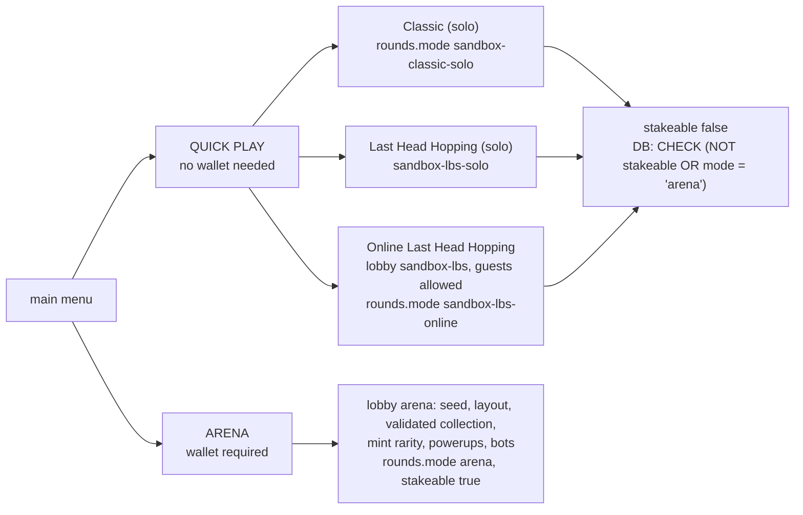

# Phase 2b: Quick Play and Arena

The game is now two families. **Quick Play** is the free sandbox: every existing mode, playable with no wallet and no stake, and nothing under it can ever be settled. **Arena** is the one staked mode, built on the server authoritative classic round from phases 1 and 2: wallet required, the only rounds phase 3 will settle. Nothing was deleted; this is a reorganisation.



## The menu, before and after

<details>
<summary>Before</summary>

```
main:        CONNECT WALLET TO PLAY ONLINE | QUICK PLAY | PLAY ONLINE | TUTORIAL | SKIN | STORE | LEADERBOARD | SETTINGS
quick play:  CLASSIC | LAST HEAD HOPPING | BACK
play online: CLASSIC | LAST HEAD HOPPING | BACK      (lobby page labelled PLAY ONLINE)
```
`STORE` was a phase 0 leftover with no handler behind it.
</details>

<details>
<summary>After</summary>

```
main:        CONNECT WALLET FOR THE ARENA | QUICK PLAY | ARENA | TUTORIAL | SKIN | LEADERBOARD | SETTINGS
quick play:  CLASSIC | LAST HEAD HOPPING | ONLINE LAST HEAD HOPPING | BACK
arena:       wallet connected -> lobby page labelled ARENA -> the server authoritative classic round
             no wallet       -> the wallet bar reads CONNECT A WALLET TO ENTER THE ARENA for a moment, nothing else happens
```
The PLAY ONLINE page is gone; its two entries went to Arena and to Quick Play. The end screen says ARENA or ONLINE by mode. The tutorial line reads "ARENA: online classic, wallet required".
</details>

## Naming

Lobby modes are `arena` and `sandbox-lbs` (`server/src/game/modes.js`). The classic ruleset object is unchanged and is selected by `arena`; the LBS ruleset by `sandbox-lbs`. The old names `classic` and `lbs` are accepted as aliases by `lobbyModeFor`, so an older client still lands in the right lobby, and anything unknown lands in the sandbox, never the arena. Round rows carry `rounds.mode` as `arena`, `sandbox-lbs-online`, `sandbox-classic-solo` or `sandbox-lbs-solo`.

## The flag downstream reads

`rounds.stakeable BOOLEAN NOT NULL DEFAULT false`. `issueRound` writes it from the lobby's rules; only the arena ruleset carries `stakeable: true`, and only a literal `true` is written. The database enforces the rule as well: `CHECK (NOT stakeable OR mode = 'arena')`, so a sandbox row cannot be marked stakeable by any code path, present or future. The schema adds the column and the constraint idempotently for existing databases.

## Guests

Quick Play's online mode must work with no wallet, and a lobby seat needed a verified wallet since phase 0. Sandbox lobbies now seat guests: `guest:<16 hex>`, random per socket, defined in `ids.js` next to bot ids and provably disjoint from addresses and bots. A guest's result rows are written with `is_bot false` under a participant no payout can reference, and `player_stats` only ever upserts real addresses. The arena refuses a seat without a wallet (`auth:denied`), and the client's ARENA entry refuses before a socket is even opened.

## What the sessions showed

```
wallet, mode arena                 -> lobby 1 mode=arena
wallet, mode classic (alias)       -> lobby 1 mode=arena
wallet, mode sandbox-lbs           -> lobby 2 mode=sandbox-lbs
guest,  mode arena                 -> DENIED: Connect a wallet to enter the arena.
guest,  mode sandbox-lbs           -> lobby 2 mode=sandbox-lbs id=guest:...
guest,  mode lbs (alias)           -> lobby 2 mode=sandbox-lbs
guest,  mode bogus / no mode       -> lobby 2 mode=sandbox-lbs
INSERT sandbox row with stakeable=true -> violates check constraint rounds_stakeable_arena_only
```

Real client, no wallet: ARENA shows the hint, no socket opens, the page stays on the main menu; QUICK PLAY > CLASSIC starts a `sandbox-classic-solo` round with a server seed and no row. Real client, wallet: ARENA opens the lobby labelled ARENA, the lobby fills with bots, and the round plays with 71 fragments and no local NPCs. No page errors.

## Arena plays exactly the phase 2 round

Nothing in the round changed. The arena is the phase 1 and 2 classic ruleset under a new name: the server issues the seed, holds the layout, validates every collection and mint, spawns and resolves powerups, and fills the lobby with bots. There is no stake yet; phase 4 adds it to this mode only.

## What cannot be confirmed headlessly

| Claim | Manual check |
|---|---|
| Quick Play works with no wallet connected at all | Fresh browser profile, never connect a wallet. Coin in, QUICK PLAY: play a Classic solo round to the end screen, a Last Head Hopping round, and ONLINE LAST HEAD HOPPING with a second guest browser (the lobby waits 30s for a second player). All three must reach an end screen |
| Arena refuses entry without one | Same profile: ARENA must only flash CONNECT A WALLET TO ENTER THE ARENA on the wallet bar and go nowhere. Then connect a wallet and ARENA must open the lobby |
| A full Arena round still completes | With a wallet: ARENA, wait for bots, play the full 3 minutes to the end screen labelled ARENA, then `/api/leaderboard/recent` shows the round with your address and `rounds.stakeable` true for it |

_(clip of the main menu, the Quick Play picker, and the ARENA refusal without a wallet goes here once someone runs it)_

## Flagged rewrites over ten lines

`server/src/game/modes.js` is rewritten (it is 60 lines; the rulesets inside it are unchanged). `gameSocket.js`: the wallet gate block at the top of quickmatch (guests). `client/index.html`: every edit is a single anchored line or a contiguous replaced block printed before and after; the largest is the `online-menu` and `multiplayer-classic` branches becoming the `arena` branch (8 lines).
