# Phase 2c: death is one state change

Reported from real play: input dead for a long stretch while the round visibly ran, control back with no explanation, the burst playing on a character that stayed visible and bouncing, a position reset some time later, and one session that died twice before ever moving. Driven headlessly through both online modes, these turned out to be three faults, none of them input.

```mermaid
stateDiagram-v2
  [*] --> Alive: round:start (seat reset)
  Alive --> Dead: health reaches 0
  state Dead {
    [*] --> Hidden
    Hidden: player.visible=false
    Hidden: lbsPlayerEliminated=true (every input path blocked)
    Hidden: knockback, jump, hop cleared; one pos update, moving false
  }
  Dead --> Spectating: LBS, others still alive
  Dead --> Respawning: classic and arena, RESPAWN IN 3, 2, 1 on screen
  Respawning --> Alive: full health, new spot, visible and controllable in one frame
  Spectating --> [*]: round ends
```

## The three faults

1. Classic and Arena: death was set and unset in the same call

`triggerPlayerDeath()` hid the player and marked it eliminated, then its classic branch immediately did `player.visible=true; lbsPlayerEliminated=false` and teleported three seconds later. Measured: after death `vis=true elim=false hp=0`, W still moved the character 18 units, then `hp=100` at a new position. The burst played on a live-looking character that was invulnerable and controllable, and the respawn was a surprise. The teleport of a live seat was also what the server clamped (three FLAG lines per death). Reproduces in solo classic; it came across with the fork.

Now the state the burst sets is kept: hidden, every input path blocked, knockback and jump cleared, the round countdown element reading RESPAWN IN 3, 2, 1 in the existing red. On the third tick the respawn lands: full health, a new spot, visible and controllable in the same frame, and a position update so other clients see it. If the round ends first, the countdown clears itself. Measured: dead window `vis=false elim=true`, W moved nothing, overlay RESPAWN IN 3 then 2, at +3.5s `vis=true elim=false hp=100` at a new spot, W moved 18 again, zero FLAG lines (a dead seat is silent and the movement window credits the gap).

2. Online Last Head Hopping: the round was never set up, so a death ended it locally

The online flow does not call `startGame()`; its `countdown` and `round:start` handlers do their own setup, so the LBS block (difficulty, NPC health and aggression, `lbsAliveCount`) never ran. `lbsAliveCount` stayed 0, and `lbsDecAlive()` on death saw `<=1` and scheduled a local `endRound()` 1.5s later: a local end screen while the server round carried on. Measured: 1.5s after death `phase=ended active=false`.

`setupLbsRound()` is that block, extracted and called from both `startGame` and `round:start`. Measured after: `alive=9`, 8 NPCs set up, death enters the spectator state as in solo, round still running.

3. Boinks landed during the lobby wait and killed players before the round

The server's boink handler never checked round status; during the wait every seat is at the origin, inside range of every other. A neighbour pressing F delivered `boink:hit`, the client applied it regardless of `gameActive`, seven hits killed a player in the lobby, and `round:start` restored health but not the eliminated flag: a round starting with a hidden, uncontrollable player while the timer ran. Measured with two guests: before, 4 of 10 lobby boinks delivered (the rest rate limited); after the server refuses boinks unless the lobby is active and the client ignores hits while not active or dead: 0 of 10, and 4 of 4 during the round. `round:start` also resets the seat unconditionally now.

## Ordering, before and after

| | before | after |
|---|---|---|
| burst | plays | plays |
| character | classic: visible and controllable at 0 HP; LBS online: hidden then a local end screen | hidden, uncontrollable, no hop, no knockback |
| other clients | keep hop animating the corpse (last `moving:1`) | get a final update with moving false |
| wait | invisible, 3s | RESPAWN IN 3, 2, 1 on screen (classic, arena); spectator overlay (LBS) |
| respawn | surprise teleport of a live seat, server clamps it | health, spot, visibility and control in one frame; no clamp |
| pre-round | hits land, a player can start the round dead | no hits outside a live round; every round starts alive |

## Still client authoritative

Death, respawn timing and the respawn spot are decided on the client, as before this fork. The server learns nothing about a death except that the seat goes silent for three seconds and reappears; it does not gate collection or powerups on being alive. A server-declared death is a phase decision, not this fix. No timeout papers over anything here: the three seconds are the same three seconds, now shown.

## What cannot be confirmed headlessly

Whether this now looks and feels right. The manual check: play an online round and a solo round. Input must work from the moment the round starts. Die on purpose (walk into the bots in LBS, or let a boink chain land in Arena). The character must disappear on the burst, it must be visibly clear you are dead rather than stuck (RESPAWN IN counting down in classic and Arena, the spectator overlay in LBS), and the respawn must not be a surprise: it lands when the count reaches zero, with you in control. In a second browser, the dead character should stop hopping the moment it dies.

_(clip of a death and respawn in Arena, and a death into spectator in online LBS, goes here once someone runs it)_
