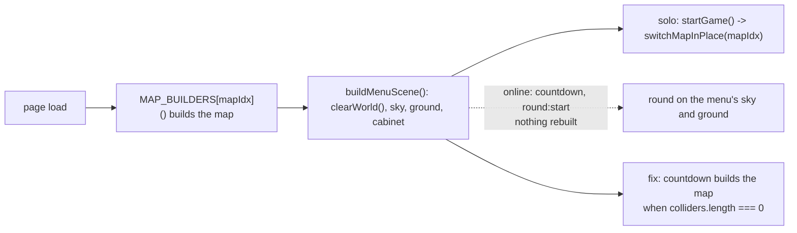

# Phase 2d: the Arena wait, and the Arena map

Two fixes to the Arena. The first is a number. The second was a recon question that turned out to have a plain answer: the Arena was not sparse, it had no map.

## 1. Lobby wait

The Arena fills empty seats with bots at countdown, so waiting 30 seconds for humans who are not coming was dead time. The wait is now per mode (`modes.js`): **arena 10 seconds**, **sandbox-lbs 30 seconds** (no bots there; the wait is for real players). `LOBBY_WAIT_SECONDS` still overrides both, for sessions and tests only. Measured with no override: `auto:starting seconds=10` for a wallet in the Arena, `seconds=30` for two guests in the sandbox.

What a sooner solo start would take

The 10 seconds exist so a second human can join before the countdown. A solo entrant can start sooner without touching the multi-human path with one client action and one server event: a START NOW button on the lobby page that emits `lobby:start-now`; the server accepts it only from a seat in a lobby whose status is `waiting` and whose humans number one, clears the wait timer and calls `beginCountdown`. About fifteen lines. The cost: a second human arriving during that countdown gets a fresh lobby instead of this one, which is already what happens once any countdown begins. Not built here; it is a design call about whether the Arena should ever start with one human and three bots on purpose.

## 2. The Arena map

### Recon

Measured in the real client, headless, on maps 0 and 3, counting scene meshes, groups, colliders, water zones and animated objects:

| map 0 | top | meshes | groups | colliders | water | anim |
|---|---|---|---|---|---|---|
| A. reseeded build (`switchMapInPlace`) | 564 | 1177 | 235 | 387 | 1 | 2 |
| B. pre-reseed play-time build, emulated | 490 | 961 | 159 | 393 | 1 | 2 |
| D. Quick Play classic round, as reached | 562 | 1119 | 231 | 387 | 1 | 2 |
| C. Arena round, as reached, **before** | 91 | 227 | 86 | **0** | **0** | **0** |
| C. Arena round, as reached, **after** | 556 | 1124 | 227 | 387 | 1 | 2 |

| map 3 | top | meshes | groups | colliders | water | anim |
|---|---|---|---|---|---|---|
| A. reseeded build | 286 | 884 | 185 | 85 | 0 | 0 |
| B. pre-reseed play-time build, emulated | 213 | 673 | 110 | 84 | 0 | 0 |
| D. Quick Play classic round, as reached | 285 | 828 | 182 | 85 | 0 | 0 |
| C. Arena round, as reached, **before** | 92 | 229 | 87 | **0** | **0** | **0** |
| C. Arena round, as reached, **after** | 279 | 833 | 178 | 85 | 0 | 0 |

(B is emulated as the original sequence: fresh stream, build once at load, the 142 fragment draws, then rebuild from the advanced stream, which is what `startGame` did before the reseed. A includes the 71 fragment groups; B does not.)

**The reseed did not thin the map.** A and B are two samples of the same builders: colliders within 2 percent, non-fragment meshes within about 8 percent, water and animated objects identical. Decoration counts vary with the stream because several builders roll their counts (`3+Math.floor(rng()*3)` trees per cluster, `2+Math.floor(rng()*2)` barrels), and the reseed fixed the sample. The visual build and the collider data come from the same source: `switchMapInPlace` runs the builder, the builder's `addC` calls fill `colliders`, and the extraction recorded exactly that after the same call. No drift.

**The Arena had no map.** `buildMenuScene()` runs at initial load (`client/index.html:4849`) and clears the world the page had just built, leaving sky, ground and the arcade cabinet. Solo rounds rebuild in `startGame()` via `switchMapInPlace`. The online `countdown` and `round:start` handlers never did, so an online round played on the menu's ground with fragments and players and nothing else: 0 colliders, 0 water, 0 animated objects, 227 meshes against 1119. Quick Play online (LBS) had the same hole. This is original code, not a phase 1 change.

### Fix

The `countdown` handler builds the map when none is built, the way `startGame` does for solo: `if(colliders.length===0){switchMapInPlace(mapIdx);window._mapBuilt=true}`. `colliders` is empty exactly when no map is built; every map has at least 55. `mapIdx` already matches the server's (the `joined` handler reloads the page otherwise). `round:start` then applies the server's layout on top, and in the Arena removes the local NPCs as before. Collider purity and the layout module are untouched: the same `switchMapInPlace`, the same reseeded builders, the same `shared/mapObstacles.cjs`.

Measured after: Arena rounds on maps 0 and 3 count what Quick Play classic counts on the same maps to within the local NPCs (absent in the Arena by design) and the fragments the bots had already taken.

## What cannot be confirmed headlessly

Whether the Arena now looks right. Manual check: play an Arena round on two maps and compare against the same maps under Quick Play classic, which the reseed and this fix did not touch. Buildings, trees, water and the animated pieces should be there in both, in the same places, and the Arena round should feel like the same map with bots in it.

_(side by side of one map under Quick Play classic and under the Arena goes here once someone runs it)_
