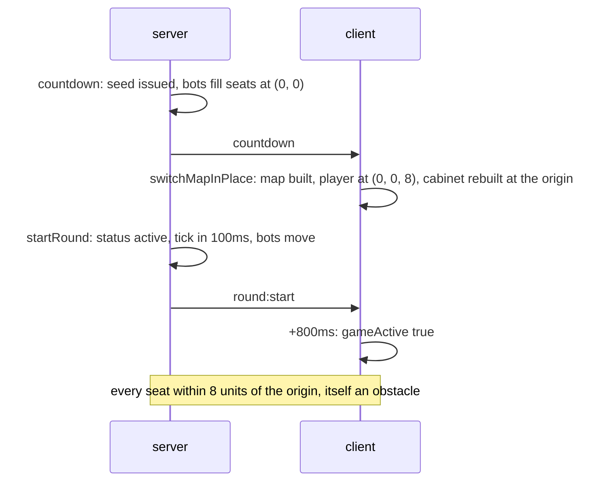

# Phase 2e: where seats start

Reported from a real browser, in the Arena, with the map rendering: the player is dead before they can move, dies twice, then control returns, and a bot stands in the same spot. This document is the recon, what could and could not be reproduced headlessly, and the four changes.

## What was there

Every seat, human and bot, was created at the origin (`createSeat`, `server/src/game/bots.js`). The client placed its own player eight units from it (`switchMapInPlace`). The origin is a recorded obstacle of radius 2.5 on maps 0 to 3 and 5 on map 4 (`shared/mapObstacles.cjs`); only map 5 has nothing there. Bots begin acting on the first server tick, 100ms after `round:start`; the client sets `gameActive` 800ms after `round:start`. So for the first second of every Arena round the whole roster stood inside boink range of one another, on top of an obstacle, with the human unable to move and its client not yet sending positions.

Measured in the real client, headless, map 1, before any change: the three bots rendered at the same point on the first tick, (1, 1), and stood 2.1 to 3.9 units from the human from +1.6s to +5.3s.

And one thing the report could see but did not name: the countdown handler from phase 2d removed the arcade cabinet and then called `switchMapInPlace`, which rebuilds it. Online rounds played with the menu cabinet at the origin, its two decorative blobs hopping in place, one of them in the green skin BOT 1 wears. `startGame` takes the cabinet down after the build; the countdown handler did it before. Measured: `cabInScene true, cabBlobs 2` in an Arena round, `false, 0` under Quick Play classic.

## Recon, question by question

**Do bots go through the 2c boink guard (`gameSocket.js`, `socket.on('boink')`)?** No, and not through any other boink path either. A bot has no socket; its only path is `driveBots` on the tick, which moves it through `applyMove` and claims through `collectFragment` and `completeMint`. Nothing on the server emits `boink:hit` on a bot's behalf, so a bot cannot hit anyone. The guard at the boink handler is a human only path.

**Where does every seat spawn?** At the origin, all of them, see above. The human's client stands at (0, 0, 8).

**Do bots act at countdown or at round start?** Round start. `startRound` sets `status = 'active'`, emits `round:start`, and the tick that drives them fires 100ms later. Nothing drives them during the countdown; `fillWithBots` only creates the records. The client is active 800ms after `round:start`, so bots move for 700ms while the human cannot.

**Does the client apply damage from a bot boink during the countdown?** It cannot receive one (above). `boink:hit` is gated on `gameActive` since 2c. `takeDamage` itself was not gated; today its only callers are `boink:hit` and code inside the main loop, which returns before any update while `gameActive` is false.

**Can anything else damage the player before the round is active?** Not in the code as it stands: the main loop returns first, the local NPC loops break on an online classic round (`client/index.html`, the three `enemies` loops), the LBS hazards never exist in the Arena. The gate on `takeDamage` makes that true for any caller that is added later.

What could not be reproduced: the death itself

Every Arena round run headlessly against the deployed server, with `takeDamage`, `triggerPlayerDeath`, `showFloat` and `showUnlock` instrumented in the served copy (the repo file untouched), ended with health 100 and zero damage calls:

| run | input | bots nearest | damage calls |
|---|---|---|---|
| map 1, 9s | none | 2.1 units for 4s | 0 |
| map 1, 12s | W held from countdown, F every 0.5s for 6s | 5.4 units | 0 |
| map 1, map 4, 5s each, after the fix | W held, F pressed | 2.9 and 58 units | 0 |

With a single human socket in the lobby (the server log shows one `joined` per Arena lobby) there is no code path that deals damage to that human: bots cannot boink, the local NPCs are idle online, and the hazards are LBS only. What the report describes matches what the cabinet put at the origin (a still blob in a bot's skin, on top of the spawn, at the moment control is withheld), but I could not make the client die, so I cannot say what did. If it happens again after this, the instrumented run is `spawn-repro.mjs` in the session scratchpad and prints a stack for every damage call.

## The four changes

1. **Seats spawn apart, off the round seed** (`server/src/game/spawns.js`, new; `startRound`). `createSpawns(seed, mapIndex, count)` draws positions from the shared position stream under its own tag (`shared/layout.cjs` `createPositionStream` gained an optional fourth argument, default unchanged), clear of the recorded obstacles by the stream's margin, each at least `SPAWN_MIN_DIST` (20) from every earlier one, in a band of half the map. `startRound` assigns them in seat order to `p.x`, `p.z` and the movement judge, and `round:start` carries `spawns: { id: { x, z } }`. Rounded to a tenth once, on the server, so both sides hold the same number.
2. **Bots act in a live round only** (`driveBots`). One guard on the bot path itself, `lobby.status !== 'active'`, so the rule does not depend on who calls it. The tick already returned before calling it; this is the invariant stated where the bots are.
3. **The client stands on its spawn and takes no damage outside a live round** (`client/index.html`, two anchored edits). `round:start` sets `player.position` from `d.spawns[myPlayerId]`; `takeDamage` returns unless `gameActive`, for every caller.
4. **The countdown takes the cabinet down after the build** (`client/index.html`, one anchored move), as `startGame` does.

### Measured after

| | map 1 before | map 1 after | map 4 after |
|---|---|---|---|
| seats on the first tick | 4 | 4 | 4 |
| smallest distance between any two seats | 0.0 | 36.0 | 62.0 |
| each seat's distance from the origin | 8, 1.4, 1.4, 1.4 | 40.7, 50.3, 37.1, 57.9 | 61.8, 59.8, 63.2, 74.1 |
| human on its spawn at GO! | no, (0, 8) | (-37.7, -15.3) | (58.8, -18.9) |
| cabinet in the scene | yes, 2 blobs | no | no |
| damage calls in the first 5s | 0 | 0 | 0 |
| W, S, A, D for 0.7s each at the spawn | | 12.6, 12.8, 8.3, 8.0 units | |

Gate green, 126 tests. The spawn tests cover all six maps over 48 seeds each: eight seats, in the band, clear of every obstacle, pairwise at least 20 apart, never at the origin, and the fallback never reached.

Found on the way, flagged, not changed

- **Derived streams share their opening.** A tag or bot slot replaces the seed's last byte, which after the XOR fold in `createRngFromHex` changes one byte of one xoshiro state word, and the first two outputs depend on another word. So every derived stream (bot brains, powerups, now spawns) shares its first two draws with the raw seed's stream, and every bot brain shares its first two draws with every other. That is why the three bots moved in lockstep for 1.6 seconds: the same roll, the same nearest fragment from the same spot. Spread spawns break the lockstep (a different nearest fragment per bot) but not the cause. The fix is a warm up in `createRngFromHex` (discard a few draws after seeding), which changes every stream for every seed and the golden vector in `prng.test.js`; nothing is committed on chain yet, so the moment to do it is before phase 3, not inside this fix. The spawn test asserts the shared opening as it is.
- **Grown bots trip the movement judge.** The user's session log: `FLAG pos bot:... path 8.5 over 606ms, allowed 6.6`. `BOT_SPEED` is a flat 14; the per seat cap shrinks with fragment count (`applyMove`), to about 10.9 for a bot carrying many. Hundreds of clamps per bot per round, all logged as flags. Phase 2 territory: either the driver slows with growth as a human does, or the cap does not apply to bots.
- **Repeated byte test seeds.** `'e1'.repeat(32)` and friends fold to an all zero xoshiro state (the guard in `generator` unsticks it, but the opening is degenerate). The spawn tests use seeds whose halves differ; the older tests still pass but exercise a poor opening.
- **Classic respawn** (2c) still lands within ten units of the origin, on the obstacle there. Not the round start, so not touched here.

## Not confirmed headlessly

Whether the round now starts cleanly for a person. Manual check: enter the Arena five times in a row and confirm you are alive and in control the moment the round starts, every time, with no bot standing on top of you, and nothing at all at the origin.

_(a clip or frame of one Arena start, GO! to first hop, goes here once someone runs it)_
