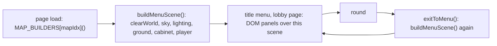
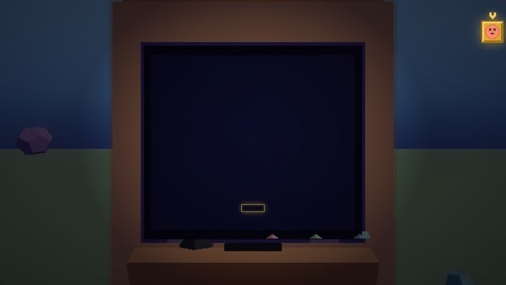
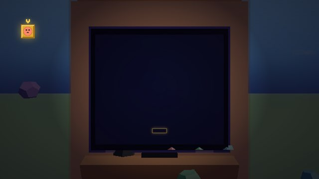
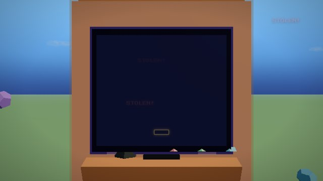
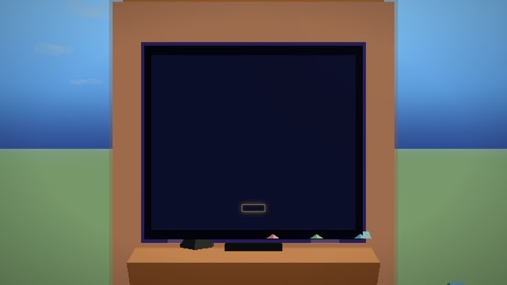
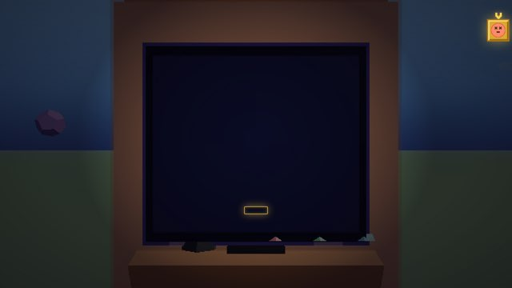
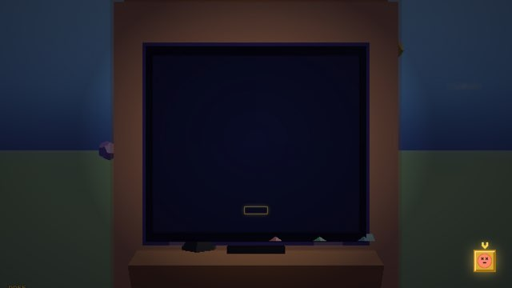
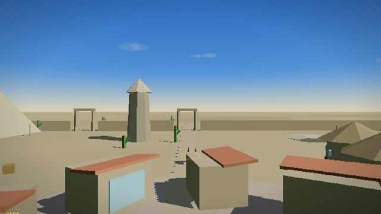

# Phase 2f: the menu and the lobby, against the original

Two screens were reported as regressions against the original game: the menu (flat blue sky, flat green ground, a few floating rocks around the arcade cabinet) and the Arena lobby wait (a text panel: title, ARENA, map name, PLAYERS 1/8, STARTING IN, BACK). The brief was to establish what the original rendered before changing anything. Answer, plainly: **both screens are what the original code renders.** No commit in this repo changed either. The one thing found on the way is a three second flash of local NPCs through the Arena countdown, a phase 2d side effect, fixed here.

## How this was established

The reference is `~/code/hoppingheads` at `e25e8d9`, `client/index.html` (byte identical to `server/public/index.html` there). Three kinds of evidence:

1. **Function text.** Every function that builds or shows the menu, hashed in both files.
2. **Bisect by text.** The menu builder extracted from every commit of this repo and compared with the original.
3. **A scene census in the real client.** The original served statically with nothing behind it (the beta gate skips on localhost), HEAD on the local Pier service, both headless in the same renderer: counts of every object in the scene, plus screenshots, at cold load, on the lobby page, and after returning from a round.



## The menu

### What `buildMenuScene` creates, in both

```js
function buildMenuScene(){
  clearWorld();
  addSky(0x88ccff,0x4a88cc,0x2a4488,0x88aadd);
  addLighting(0xffeeaa,0.85,0.55);
  addGround((x,y)=>{const b=0.3+Math.sin(x*0.05)*0.03+Math.sin(y*0.05)*0.03;return [0.35+b*0.1,0.55+b*0.05,0.28+b*0.08]});
  arcadeCab=buildArcadeCab();arcadeCab.position.set(0,0,0);scene.add(arcadeCab);
  scene.add(player);player.position.set(0,0,8);player.rotation.y=0;
  boundR=65;
}
```

A sky sphere with fog and twelve cloud groups, three lights, one ground plane in the green above, the cabinet, the player. No map: `clearWorld()` throws away the map that page load had just built, on purpose. The floating rocks are the clouds from `addSky`: twelve groups of three to five flattened spheres at height 38 and up, white at opacity 0.15, and the ones near the horizon read as rocks from the menu camera. At cold load the cabinet is powered off (the coin has not gone in) and the scene is dim; after a round it is lit. Same in both clients.

### Function text, original versus HEAD

| function | lines | original | HEAD | |
|---|---|---|---|---|
| buildMenuScene | 9 | 67534146 | 67534146 | same |
| addSky | 6 | 9b9abf60 | 9b9abf60 | same |
| addLighting | 6 | a519908b | a519908b | same |
| addGround | 6 | 8b3b5646 | 8b3b5646 | same |
| buildArcadeCab | 114 | 25e812b5 | 25e812b5 | same |
| clearWorld | 14 | 91317d24 | 91317d24 | same |
| showMenuPage | 5 | 048926b3 | 048926b3 | same |
| exitToMenu | 85 | e8ee2f47 | e8ee2f47 | same |
| updateLobbyUI | 10 | 7efc52c1 | 7efc52c1 | same |

### Bisect

`buildMenuScene` at every commit of this repo, against the original (md5 of the function text, and whether the initial load and `exitToMenu` calls are present):

| commit | | calls | |
|---|---|---|---|
| a1dd053 init: seed from the hoppingheads working tree | 67534146 | yes | same |
| 0cd2d4d Phase 0 | 67534146 | yes | same |
| 6efcb60 Phase 1 | 67534146 | yes | same |
| 013d8e8 Phase 1b | 67534146 | yes | same |
| 1401c0b Phase 2 | 67534146 | yes | same |
| bd116fe Phase 2b | 67534146 | yes | same |
| 61a1d55 Phase 2c | 67534146 | yes | same |
| ff1a03e Phase 2d | 67534146 | yes | same |
| 6f40964 Phase 2e | 67534146 | yes | same |

The two suspects named in the brief do not touch the menu: the 2d countdown build and the 2e cabinet removal both run inside the `countdown` socket handler, after the title screen is gone, and `exitToMenu` rebuilds the menu from scratch afterwards (`buildMenuScene`, then `_mapBuilt=false`).

### Census, map 1

Every object in the scene. `top` is `scene.children`; `mesh` is every mesh at any depth.

| state | client | top | mesh | groups | lights | clouds | cabinet | player | colliders |
|---|---|---|---|---|---|---|---|---|---|
| cold load | original | 19 | 119 | 16 | 3 | 12 | yes, 2 blobs | yes | 0 |
| cold load | HEAD | 19 | 118 | 16 | 3 | 12 | yes, 2 blobs | yes | 0 |
| title menu | original | 19 | 119 | 16 | 3 | 12 | yes | yes | 0 |
| title menu | HEAD | 19 | 118 | 16 | 3 | 12 | yes | yes | 0 |
| after a solo round, back to menu | original | 19 | 118 | 16 | 3 | 12 | yes | yes | 0 |
| after a solo round, back to menu | HEAD | 19 | 120 | 16 | 3 | 12 | yes | yes | 0 |
| after an Arena round, back to menu | HEAD | 19 | 122 | 16 | 3 | 12 | yes | yes | 0 |

Per object: sky 1 mesh, ground 1, cabinet 56, player 12, in every row of every client. The only number that moves is the cloud puffs, 45 to 52 across runs: each cloud rolls its puff count off the gameplay `rng`, whose state depends on what ran before `addSky`. That is the whole of the 118 versus 119, and of 120 and 122 after a round. Top level composition is identical everywhere: 2 meshes, 14 groups (12 clouds, cabinet, player), 3 lights.

<details>
<summary>The original's own history of this menu</summary>

The arcade only menu is not old. In the original repo: the cabinet arrived 2026-04-07 (`f979a34`, arcade coin insert), `buildMenuScene` and the "menu arcade scene" 2026-04-18 (`3474fef`), and the initial load call 2026-04-19 (`96eb6ff`, "build menu scene on initial load to prevent dark flash on reload"). Before 2026-04-18 the menu stood in the map. If the remembered menu had the map behind the cabinet, it is that earlier version, five months before this repo was seeded, and restoring it would be a change to the original's design, not a repair.
</details>

| original, menu | HEAD, menu |
|---|---|
|  |  |

| original, after a solo round | HEAD, after an Arena round |
|---|---|
|  |  |

## The lobby wait

### What the original rendered

A DOM panel over the menu scene. The page:

```html
<!-- MULTIPLAYER LOBBY -->
<div id="menu-lobby" class="menu-page" style="display:none">
  <div class="menu-label">PLAY ONLINE</div>
  <div id="lobby-map" class="menu-map"></div>
  <div id="lobby-count" class="menu-status"></div>
  <div id="lobby-status" class="menu-sub"></div>
  <div class="menu-item" data-action="back">BACK</div>
</div>
```

The handlers that fill it during the wait:

```js
socket.on('player:joined',(d)=>{
  if(d.extras&&Object.keys(d.extras).length) remoteExtras.set(d.id,d.extras);
  updateLobbyUI(d.count);
});
socket.on('auto:starting',(d)=>{
  const s=document.getElementById('lobby-status');
  if(s)s.textContent=`MATCH STARTS IN ${d.seconds}s...`;
});
socket.on('lobby:wait',(d)=>{
  const countEl=document.getElementById('lobby-count');
  const statusEl=document.getElementById('lobby-status');
  if(countEl)countEl.textContent=`PLAYERS: ${d.players}/${d.max}`;
  const m=Math.floor(d.seconds/60),sec=d.seconds%60;
  if(statusEl)statusEl.textContent=d.seconds>0?`STARTING IN ${m}:${sec<10?'0':''}${sec}`:'STARTING NOW...';
});
```

No player is placed in the scene during the wait: `player:joined` only updates the count, and remote meshes are created by the `tick` handler, which the server starts at round start. There is no live arena and no second scene. The original showed the menu scene (cabinet, sky, ground) behind a text panel reading PLAY ONLINE, the map name, PLAYERS n/8, STARTING IN m:ss, BACK.

### HEAD

The same page and the same handlers, text for text, with two intended differences from phase 2b: the label is `ARENA` (or `ONLINE LAST HEAD HOPPING` for the sandbox) and the list has the sandbox entry. Census on the real Arena lobby: top 19, mesh 118, 12 clouds, cabinet with 2 blobs, player, 0 colliders, page `menu-lobby`; the original's lobby page: 19, 119, the same objects.

| original, lobby page | HEAD, Arena lobby wait |
|---|---|
|  |  |

## Returning from a round

Both clients rebuild the menu through `exitToMenu` and `buildMenuScene`, identical text. Structure after the return is the structure at cold load in both (19 top level, cabinet 56, player 12, sky, ground, 12 clouds); only the cloud puff count moves, in the original too (119 to 118). The scene is lit after a round and dim at cold load, in both, because cold load is the cabinet before the coin.

## The one change

Beyond the two screens, in the flow the manual check walks through: `switchMapInPlace`, which the 2d countdown handler now calls, re-adds the eight local NPCs along with the map. `round:start` removes them for online classic, so under 2d and 2e they stood in the arena for the three second countdown and vanished at GO!, replaced by the server's bots on the first tick. Measured: `npcs=8` through the countdown, `0` in the round. The countdown handler now hides them right after the build, with the same condition `round:start` uses (`client/index.html`, one anchored insertion, printed before and after). After: `npcs=0` through the countdown. Nothing else changed; the menu census is identical before and after this edit, and the Arena still builds its map (383 colliders on map 1 through countdown and round).



## Not built

Nothing to restore. Reverting the 2d build or the 2e cabinet removal would change the countdown and the round, not the menu, and would bring back the bare plane.

## Not confirmed headlessly

Whether the screens look right to a person. The census and the screenshots are the same renderer for both clients, so the comparison is fair, but a headless swiftshader frame is not the user's screen. Manual check: cold load the menu, enter the Arena and watch the full countdown, play the round, return to the menu, and confirm all three screens match the original at `~/code/hoppingheads`.
