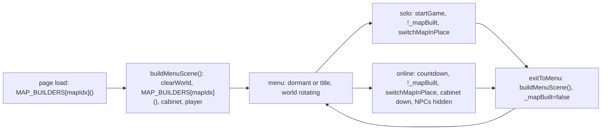
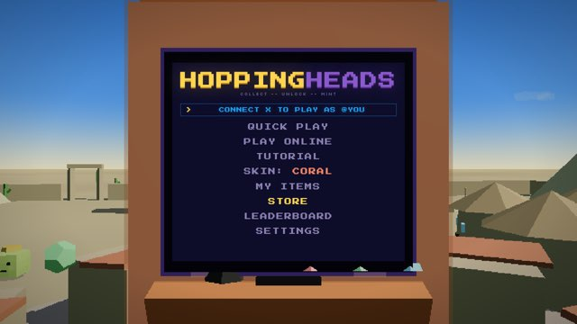
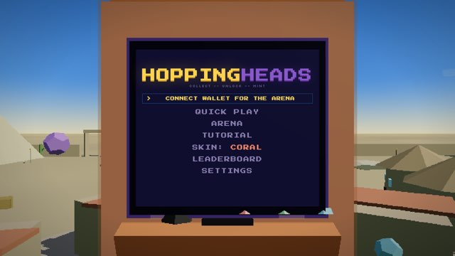
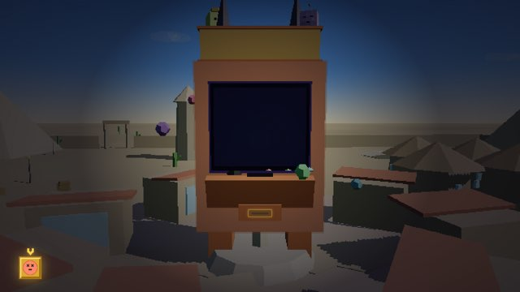
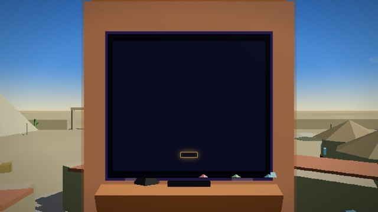

# Phase 2g: the map behind the menu

The menu is the arcade cabinet standing in a map, the world turning slowly under a still camera. Established by read only analysis of the original repo (not re-derived here): the rotation never stopped running, and two deliberate commits there removed the world it turned. `3474fef` (2026-04-18) added `buildMenuScene`, an arcade only scene, and called it from `exitToMenu`, so the map was gone on return from a round; `96eb6ff` (2026-04-19) called it at cold load too. Timed map cycling never existed; what cycled was a random map per cold load plus the PREV and NEXT MAP arrows. This phase puts the map back on both paths, keeps the cabinet rebuild `3474fef` fixed, and rewires the phase 2d countdown test that depended on the menu being empty.



## The change

Three anchored edits in `client/index.html`, each printed before and after.

**`buildMenuScene`** builds the map instead of a bare sky and ground. Before:

```js
function buildMenuScene(){
  clearWorld();
  addSky(0x88ccff,0x4a88cc,0x2a4488,0x88aadd);
  addLighting(0xffeeaa,0.85,0.55);
  addGround((x,y)=>{const b=0.3+Math.sin(x*0.05)*0.03+Math.sin(y*0.05)*0.03;return [0.35+b*0.1,0.55+b*0.05,0.28+b*0.08]});
  arcadeCab=buildArcadeCab();arcadeCab.position.set(0,0,0);scene.add(arcadeCab);
  scene.add(player);player.position.set(0,0,8);player.rotation.y=0;
  boundR=65;
}
```

After:

```js
function buildMenuScene(){
  clearWorld();
  {const gameplayRng=rng;rng=m32(MAP_DECOR_SEED);MAP_BUILDERS[mapIdx]();rng=gameplayRng}
  arcadeCab=buildArcadeCab();arcadeCab.position.set(0,0,0);scene.add(arcadeCab);
  scene.add(player);player.position.set(0,0,8);player.rotation.y=0;
  boundR=65;
}
```

Each map builder brings its own sky, lighting and ground, in its palette, and the decor rebuilds from the fixed decor stream (phase 1), so the menu shows exactly the map a round on it plays. The same function runs at cold load and from `exitToMenu`, so both paths produce the same scene, cabinet included: the `3474fef` fix (a return from a round used to leave the cabinet out) stays fixed by construction. NPCs, fragments and the layout are not in the menu; they belong to a round and `switchMapInPlace` builds them when one starts. (At the original's `3474fef^` the NPCs stood in the menu at cold load as a side effect of the load order, and not after a return; this is the one place the restored menu is tidier than the old one.)

**The 2d countdown test.** It read `if(colliders.length===0)` as "the menu has no map", which is now never true, so the Arena would have played on the menu's map without NPCs, fragments or layout. `window._mapBuilt` is the flag that means what the test wanted: false at load and set false by `exitToMenu`, set true by `startGame` and by the countdown once the round's map is built. The countdown now reads `if(!window._mapBuilt)`, the same test `startGame` uses for solo.

**The initial call's comment** now says what the build is for.

## The 96eb6ff question

`96eb6ff` existed to stop "a black canvas with only the naked cabinet" on a reload mid match. Verified rather than assumed, in the real client, headless, with the coin already inserted in session storage (the reload mid match path; the page then skips the coin and comes up in the title phase):

| client | reload with the coin in | 
|---|---|
| original at `bfe1a69`, the commit right before `96eb6ff`, map built at load | title phase, map behind the cabinet, lit: colliders 179, meshes 863 |
| this branch | title phase, map behind the cabinet, lit: colliders 383, meshes 649 |

| original `bfe1a69`, reload mid match | this branch, reload mid match |
|---|---|
|  |  |

The black canvas does not reproduce with a map built at load, on either side of `96eb6ff`, in this renderer. The map builders light their own scene, so a menu with a map in it is not the dark case; what produced the black canvas then is not recoverable from the code and is not the map.

## Measured

Map 1 unless stated. `mesh` is every mesh at any depth, `top` is `scene.children`.

| state | colliders | mesh | top | cabinet | NPCs | frags | `_mapBuilt` | rotation |
|---|---|---|---|---|---|---|---|---|
| before (phase 2f), menu at cold load | 0 | 118 | 19 | yes, 2 blobs | 0 | 0 | false | running, nothing to see |
| cold load, dormant | 383 | 649 | 305 | yes, 2 blobs | 0 | 0 | false | 0.059 to 0.193 rad in 1.5s |
| reload with the coin in, title | 383 | 649 | 305 | yes | 0 | 0 | false | running |
| solo classic round | 383 | 807 | 383 | no | 8 | 71 | true | 0 |
| menu after the solo round | 383 | 649 | 305 | yes, 2 blobs | 0 | 0 | false | running |
| Arena lobby wait | 383 | 649 | 305 | yes | 0 | 0 | false | running |
| Arena countdown | 383 | 735 | 375 | no | 0 | 71 | true | |
| Arena round | 383 | 760 | 378 | no | 0 | 71 | true | 0 |
| menu after the Arena round | 383 | 649 | 305 | yes, 2 blobs | 0 | 0 | false | 0.025 to 0.089 rad in 1.5s |
| second Arena countdown, same page | 383 | 735 | 375 | no | 0 | 71 | true | |

Six cold loads of `/game` without `?map`: maps 5, 2, 0, 3, 2, 4, colliders 60, 120, 387, 85, 120, 55. A different map across loads, as the original. No page errors on any path. Gate green, 126 tests.

| cold load, dormant | menu after the Arena round |
|---|---|
|  |  |

<details>
<summary>Notes for later, not changed</summary>

- The map is now built twice at page load: once by the load sequence (`MAP_BUILDERS[mapIdx]()` before the cabinet and NPCs are created) and once by `buildMenuScene`. It was built once and then thrown away before; now it is built, thrown away, and built again. Milliseconds, and the load time build is what the NPC and fragment setup runs against, so it was left alone.
- A random map per load holds for `/game` without `?map`. Once a round has run, `switchMapInPlace` writes `?map=N` into the URL, and the online `joined` handler reloads to the server's `?map=`, so a browser reload after that keeps the same map. Original behaviour, kept.
- The menu build does not place NPCs. If the old menu with blobs hopping around the cabinet is wanted, that is one more line in `buildMenuScene` and a decision about whether they should hop before a coin goes in.
</details>

## Not confirmed headlessly

Whether it looks right. Manual check: cold load the menu several times and confirm a map is there and a different one appears across loads (open `/game` without `?map`); play an Arena round and return to the menu and confirm the map is there too, cabinet in it, world turning; and confirm the Arena itself still has its map.
