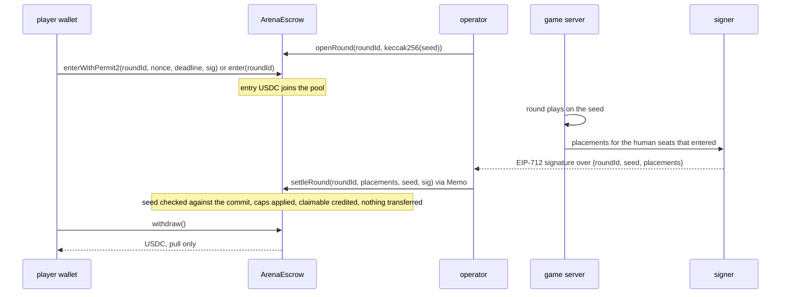

# Phase 3: the escrow on Arc testnet

The money surface, standalone. ArenaEscrow holds a house funded USDC pool on Arc and pays on placement in an Arena round; a CLI drives it with no game attached. Two cleanups came first because they get expensive once a seed carries money: the PRNG warm up and the bot speed cap. Nothing here is wired to the game; that is phase 4.

## Recon

**Toolchain.** Arc Foundry (circlefin/arc-foundry, a fork of Foundry that runs Arc's own EVM) installs here: the v0.8.0-1 release ships an Apple Silicon build (v0.8.0-2 ships Linux only), checksum verified, installed as `arc-forge`, `arc-cast`, `arc-anvil`, plus `brew install libusb` for a dylib the binaries link. `arc-anvil --network arc` comes up with the predeploys: USDC at `0x3600...0000` (6 decimals, one balance with the 18 decimal native view), Permit2, Memo, Multicall3, and a 21 gwei base fee that refuses anything under it. One gap: the callFrom precompile (`0x18...03`) that the Memo contract forwards through is not implemented in v0.8.0-1 (`OpcodeNotFound`), so the Memo stamp could only be exercised on testnet, where it ran (below). Everything else about the contract is tested locally, on Arc semantics, in the gate.

**What the round rows carry.** `rounds` has `seed`, `stakeable` (arena only, by constraint), `commit_hash`, `signature`, `tx_hash`, `entry_fee_wei`, `prize_pool_wei`, `winner`. `round_results` has `participant`, `is_bot`, `score`, `placement`, unique per round and participant. Missing for settlement: the on chain `roundId` (bytes32; the SERIAL `id` is not it), the seed commitment as its own column (`commit_hash` was reserved for the result set), a per participant payout in USDC units, and the settlement block. Not added here; phase 4 wires the game and adds them with the service that needs them.

**Three id spaces, provably disjoint** (`server/src/game/ids.js`): humans `^0x[0-9a-f]{40}$`, bots `^bot:[0-9a-f]{8}:\d{1,3}$`, guests `^guest:[0-9a-f]{16}$`. A payout can only reference a human: `Placement.player` is an `address` by ABI type, so a bot or guest id cannot be encoded into a settlement at all, and on top of that the contract requires the address to be non zero, seated in that round (it paid the entry) and listed once. The settlement service will filter with `isHumanId` before signing; the contract does not rely on it.

**Where placement is decided today.** `endRound` (`server/src/ws/gameSocket.js`) sorts seats by score, assigns `placement = index + 1`, emits `round:end` and writes `round_results`. A settlement service signs `Settlement { roundId, seed, placements[] }` under the EIP-712 domain `ArenaEscrow / 1 / chainId / contract`, for the human seats that entered on chain, in placement order, and the operator submits it. The seed it reveals is the one `issueRound` generated at countdown and committed at `openRound`.

## The two cleanups

**Seeds.** Every derived stream replaces the seed's last byte (bot slots, powerups, spawns). After the XOR fold that changed one byte of one xoshiro state word, and the first two outputs came from another, so every derived stream opened with the raw seed's two draws and every bot brain with every other. `createRngFromHex` now discards 16 steps after seeding. Measured: 256 tags on one seed give 256 different openings, none equal to the raw seed's, adjacent tags differ in 16.2 of 32 bits on the first draw. This changes every stream for every seed, before any seed is committed to on chain. The hex golden vector is regenerated and pinned (the old test only compared a draw with itself). Client and server share the file byte for byte and the test that runs both paths passes.

**Bot speed.** `BOT_SPEED` was a flat 14 while the cap shrinks with fragments, so grown bots were clamped every tick. `movement.js` exports `growCap`, `botDriver.js` exports `botSpeed`, and the driver runs each bot under exactly the cap the judge holds it to. Test: four bots over a 180 second round of jittered ticks, growing with every claim, fresh and starting grown: zero flags; the old flat pace under a grown cap is flagged, as the control.

## Architecture



One contract, no proxy, no upgrade path, no selfdestruct, no payable function, no `msg.value`. The settlement interface (`IArenaSettlement`) is what the pooled pot and the personal best models implement in later phases; only the house backed implementation ships now.

### Roles

| role | holds | can |
|---|---|---|
| owner | the pool's key | set operator and signer, tiers, caps, pause, withdraw the free pool (never what players are owed), hand over ownership in two steps |
| operator | gas | open rounds, submit settlements |
| signer | nothing | sign settlements |

A settlement needs the signer's signature and the operator's transaction. The three must be distinct addresses; the contract refuses otherwise.

### Caps, in the contract

| cap | what it bounds |
|---|---|
| `maxPayoutPerRound` | credited per settlement; a tier table must fit it |
| `maxPayoutPerPlayerPerWindow` over `windowBlocks` | credited to one address per rolling window, measured in blocks |
| pool solvency | never more owed in total than the contract holds |
| pause | enter, settle and withdraw stop; owner only |

A compromised signer cannot settle alone (the operator submits). A compromised signer and operator together are bounded per round and per player per window, cannot pay an address that did not enter, and cannot reach the pool except through those credits; the owner pauses and rotates the keys.

## Arc constraints and where each lands

| fact | where it is handled |
|---|---|
| USDC is native gas and an ERC-20 at `0x3600...0000`, one balance, 18 and 6 decimals | contract and CLI use only the ERC-20 view; no payable, no `msg.value`, no native reads; the fork test `oneBalanceTwoViews` shows the two views of the escrow's balance agree at 1e12 |
| mempool silently drops `maxFeePerGas` under 20 gwei | one `send` in the CLI sets it on every transaction, twice base plus a 1 gwei tip, never under the floor; `floor-check` sends one raw under the floor and shows what the node does (testnet: accepted, never mined, nonce left queued; see the testnet section); base fee measured at exactly 20 gwei |
| PREVRANDAO is 0, no VRF | no on chain randomness anywhere; the seed is generated off chain, committed before the round, revealed at settlement |
| value transfers to the zero address and to or from blocklisted addresses revert and consume gas | payouts are pull only; a blocked recipient's withdraw reverts alone, its credit stays, nobody else is affected (tested) |
| timestamps are non decreasing, not increasing | the rolling window is `block.number` based; nothing in the contract reads a timestamp (Permit2's deadline is Permit2's own check) |
| Permit2 predeployed | `enterWithPermit2`: one signature per entry after a one time approval of Permit2 (fork tested against the real predeploy) |
| Memo predeployed, EOA only, sequential index | the CLI settles through `Memo.memo(escrow, calldata, roundId, note)`, so each settlement has a Memo event carrying the roundId; local arc-anvil lacks the precompile behind it, so that path is proven on testnet (Memo indices 782933 and 783039, below) |
| finality on inclusion | receipts are final; the CLI waits for one and prints it |
| blocks every 0.5 s on testnet (2000 blocks in 1000 s, measured) | `WINDOW_BLOCKS=172800` is a day |

## Threat model

| threat | outcome |
|---|---|
| signer key stolen | cannot submit (operator only); if the operator is also lost, credits are bounded by the round cap, the per player window cap and the pool, and only to addresses that entered; owner pauses and rotates |
| operator key stolen | can open rounds and submit real signatures only; cannot forge a settlement |
| owner key stolen | can retune tiers and caps, rotate roles, pause, and withdraw the free pool: the trust root. Use a multisig for it in production |
| replay of a settlement | roundId is single use, the round is marked settled, the digest binds roundId, seed, placements, chain id and contract address |
| tampered placements or seed | signature no longer recovers to the signer; the seed must hash to the commit |
| a settlement naming an address that never paid | `NotEntered` |
| a bot or guest in a settlement | unencodable (`address` type) and unseated |
| reentrancy on withdraw | nonReentrant, balance zeroed before the transfer |
| draining the pool through many rounds | round cap and per player window cap, on chain; the owner sees `freePool` fall and pauses |
| a blocklisted winner | their withdraw reverts, their credit stays; no one else blocked |
| a transaction under the fee floor | never produced by the harness; the node refuses or never mines it |
| more than eight entrants in a round | allowed on chain (entries add to the pool, at most eight placements are paid); phase 4 matches seats to entries before the round starts |

## Tiers and how to tune them

Constructor parameters, owner settable after deploy (`setTiers`, `setCaps`, `setEntryAmount`), all in USDC 6 decimal units:

| parameter | default | meaning |
|---|---|---|
| `ENTRY_AMOUNT` | 500000 | 0.50 USDC per seat |
| `TIERS` | 1200000, 700000, 400000 | 1st 1.20, 2nd 0.70, 3rd 0.40; a place beyond the table pays 0 |
| `MAX_PAYOUT_PER_ROUND` | 2300000 | the table must fit it |
| `MAX_PAYOUT_PER_PLAYER_PER_WINDOW` | 20000000 | 20 USDC per address per window |
| `WINDOW_BLOCKS` | 172800 | a day of 0.5 s blocks |

With eight humans a round takes in 4.00 and pays at most 2.30; with one human and seven bots it takes in 0.50 and can still pay 1.20, so the pool subsidises thin rounds by design. Tuning: change `TIERS` and the caps with the owner key (a table that does not fit the round cap is refused; the round cap and the window cap are the true bounds). Whether these numbers make sense against real score distributions cannot be known yet; see the last section.

## Tests

26 unit tests against a 6 decimal USDC mock with a blocklist and 4 fork tests against arc-anvil's real predeploys (one skipped locally, the Memo path), all in the gate: `npm run contracts`. Listed in the commit message of the contract and in `contracts/test`. The fee floor check runs after them against the same arc-anvil.

## The CLI cycle, measured on arc-anvil

`node cli/cycle.mjs 5 --permit2` with arc-anvil's default accounts as the four roles (local only; those keys are public):

| step | pool | owed | free | owner | player | claimable | gas | cost |
|---|---|---|---|---|---|---|---|---|
| start | 0 | 0 | 0 | 999999.94 | 1000000.00 | 0 | | |
| fund 5 (approve, fundPool) | 5.00 | 0 | 5.00 | 999994.94 | 1000000.00 | 0 | 55438 + 52098 | 0.0023 |
| open | 5.00 | 0 | 5.00 | | | | 75316 | 0.0016 |
| enter via Permit2 (approve Permit2 once, enterWithPermit2) | 5.50 | 0 | 5.50 | | 999999.50 | 0 | 55726 + 126559 | 0.0038 |
| settle, player first | 5.50 | 1.20 | 4.30 | | 999999.50 | 1.20 | 163030 | 0.0034 |
| withdraw | 4.30 | 0 | 4.30 | | 1000000.69 | 0 | 55814 | 0.0012 |

A second cycle on the approve path: enter 85858 gas, settle 148116 (0.0031 USDC), withdraw 55814. Deploy: 2731018 gas, 0.057 USDC. Costs are gas times the effective price (22 gwei there, 20 gwei base on testnet), read from the receipt in the native 18 decimal view and shown as USDC.

**Gas cost of a settlement: 148k to 163k gas, about 0.003 USDC at Arc's floor.**

## Testnet

Deployed on Arc testnet, chain 5042002. **ArenaEscrow: [`0xF50e5b345293B027046400Ae0d9D02F7b67bD72B`](https://explorer.testnet.arc.io/address/0xF50e5b345293B027046400Ae0d9D02F7b67bD72B)**, deploy transaction [`0x903f80f1...`](https://explorer.testnet.arc.io/tx/0x903f80f1a9a0ddbb8860d1a1467de59f462da2ca882a25ae020ed02d4f1ca42a), 2,720,619 gas, 0.057133 USDC. Constructor: entry 0.50, tiers 1.20 / 0.70 / 0.40, cap per round 2.30, cap per player per window 20.00, window 172800 blocks.

The four roles (keys in the gitignored `contracts/.env`, mode 600; never in a tracked file):

| role | address | before | after everything below |
|---|---|---|---|
| owner | `0x10EA64B8576644D814A31438642E28B14e129a5d` | 20.000000 | 9.940608 (deploy, approve, 10.00 into the pool) |
| operator | `0x0a8e8563fF548c71850a916690cd938994E92F79` | 20.000000 | 19.989492 (two opens, two settlements) |
| signer | `0xB5C020E301481713D104e474E7A2550012Aed9ff` | 0 | 0 (signs, never transacts) |
| player | `0x70d4172FF4392e2Ed1996dB6430b706c8cD3859b` | 20.000000 | 21.390783 after the two rounds; 21.388956 after the fee floor probes |

Balances are the USDC ERC-20 view, read before anything was spent.

### The live cycle

Round 1, approve path, settled through Memo. Round 2, Permit2 path, settled through Memo. USDC balances after each step:

| step | pool | owed | free | owner | player | claimable | tx |
|---|---|---|---|---|---|---|---|
| start | 0 | 0 | 0 | 19.942867 | 20.000000 | 0 | |
| fund 10: approve, fundPool | 10.00 | 0 | 10.00 | 9.940608 | 20.000000 | 0 | [approve](https://explorer.testnet.arc.io/tx/0x47a78b314a30a3c9952510d6215a6e8817f5ce770a1c1807d63dd05d9d94a894), [fundPool](https://explorer.testnet.arc.io/tx/0x888dc30d50735f66f2d18ef84f5f6d7568143b05a32ca974f2689af67aec1eca) |
| open round 1 | 10.00 | 0 | 10.00 | | | | [openRound](https://explorer.testnet.arc.io/tx/0x469592ec160f3afea5b7c1e25aa6f5f6f335fd63061061bc3b2fa68dc544935e) |
| enter, approve path | 10.50 | 0 | 10.50 | | 19.496991 | 0 | [approve](https://explorer.testnet.arc.io/tx/0x38d052d1e008e140db6f7ae0e24874863fa3d939e218b2176d807d12c1b78b50), [enter](https://explorer.testnet.arc.io/tx/0x4ab91bdaf99c9b211425c3a9bacd3a0aeca611ca6a992a6044f310323d19e058) |
| settle round 1 via Memo, player first | 10.50 | 1.20 | 9.30 | | 19.496991 | 1.20 | [settleRound via Memo](https://explorer.testnet.arc.io/tx/0x364c38232881e8368fc4b1f7a6a6df6a6349ff70e28c81f5cee37bb54f56c311) |
| withdraw | 9.30 | 0 | 9.30 | | 20.695819 | 0 | [withdraw](https://explorer.testnet.arc.io/tx/0xbf13d9e03e8cd46a49190b5f0f22457ec8c515d54ae3437e3131b0d2cbd717af) |
| open round 2 | 9.30 | 0 | 9.30 | | | | [openRound](https://explorer.testnet.arc.io/tx/0xff5fbd7a129a8399a6bdfc871bdcf0681f40bfb396617fb5d4405e8fff45e87a) |
| enter, Permit2 path (approve Permit2 once, then one signature) | 9.80 | 0 | 9.80 | | 20.191955 | 0 | [approve Permit2](https://explorer.testnet.arc.io/tx/0x3d2613963fa0167384da62b20b1653a57f4c72e6117bcbbf4bcfef9ac414d264), [enterWithPermit2](https://explorer.testnet.arc.io/tx/0xa778e9e6cf1a7841a3038b12b39c4702d7c2ee8a5d56998b31191b2726ebd8ca) |
| settle round 2 via Memo, player first | 9.80 | 1.20 | 8.60 | | 20.191955 | 1.20 | [settleRound via Memo](https://explorer.testnet.arc.io/tx/0x0dd80ec6fd26a1c181bd54cfdf924b118ca292b19fc46969ab8474338fce567f) |
| withdraw | 8.60 | 0 | 8.60 | | 21.390783 | 0 | [withdraw](https://explorer.testnet.arc.io/tx/0x6a2bf8b6fe18a0ef2d4d94522b8d04ecc8cc3c89223e1f12e31b8056e759943c) |

Every transaction was sent with `maxFeePerGas` 41 gwei (twice the 20 gwei base plus a 1 gwei tip) and mined at an effective 21 gwei.

### Gas, testnet against arc-anvil

| transaction | arc-anvil gas | testnet gas | testnet cost, USDC |
|---|---|---|---|
| deploy | 2,731,018 | 2,720,619 | 0.057133 |
| approve (USDC to escrow) | 55,438 | 55,426 | 0.001164 |
| fundPool | 52,098 | 52,098 | 0.001094 |
| openRound | 75,316 | 75,180 and 75,192 | 0.001579 |
| enter (approve path) | 85,858 | 87,816 | 0.001844 |
| approve Permit2 (once) | 55,726 | 55,726 | 0.001170 |
| enterWithPermit2 | 126,559 | 128,300 | 0.002694 |
| settleRound, direct | 148,116 and 163,030 | not used on testnet | |
| settleRound through Memo | not available locally | 182,670 and 167,297 | 0.003836 and 0.003513 |
| withdraw | 55,814 | 55,814 | 0.001172 |

Divergence: within 2 percent everywhere the same path ran on both; the Memo wrapper adds about 19,000 gas (BeforeMemo, the callFrom hop, Memo) over a direct settlement. **A settlement through Memo costs 0.0035 to 0.0038 USDC at Arc's floor; direct, about 0.0031.** Costs are gas times the effective price from the receipt, in the native 18 decimal view, shown as USDC.

### The Memo stamp, first real run

The callFrom precompile is unimplemented in arc-anvil, so this was the first time the path ran. It works: both settlements went through `Memo.memo(escrow, settleRound calldata, roundId, note)` from the operator, the escrow saw the operator as sender (`onlyOperator` held), the round settled, and the predeploy emitted `BeforeMemo` then `Memo` around the escrow's `Credited` and `RoundSettled` events.

| round | Memo event index | memoId | receipt |
|---|---|---|---|
| 1 | 782933 | `0x7926d784...2014e8` (the roundId) | [0x364c3823...](https://explorer.testnet.arc.io/tx/0x364c38232881e8368fc4b1f7a6a6df6a6349ff70e28c81f5cee37bb54f56c311) |
| 2 | 783039 | `0x7556d52b...70fda0` (the roundId) | [0x0dd80ec6...](https://explorer.testnet.arc.io/tx/0x0dd80ec6fd26a1c181bd54cfdf924b118ca292b19fc46969ab8474338fce567f) |

The index is the predeploy's global counter (other users of it sit between the two); `sender` is the operator, `target` the escrow, `callDataHash` the keccak of the settleRound calldata, `memo` the note bytes.

### The 20 gwei floor, on the real network

Measured with raw `eth_sendRawTransaction` from the player, base fee exactly 20 gwei:

- at 1 gwei and at 19.9 gwei the RPC **accepts** the transaction and returns a hash; no receipt ever appears: the silent drop, as documented;
- the sender's **pending nonce advances and stays advanced**: the dropped transaction sits in the node's pending view and every later transaction from that account queues behind it, unmined, until a replacement at the same nonce with a proper fee lands (measured: latest 6, pending 8 after two probes; two replacements at 41 gwei cleared it);
- viem's `writeContract` never reaches that state because its pre-flight (`eth_estimateGas`) is refused with "fee cap cannot be lower than the block base fee"; a worker that signs and submits raw gets a hash and silence. That is the invisible failure a phase 4 settlement worker must not have: set the fee on every transaction (one `send`, as here), wait for a receipt with a deadline, and on timeout replace at the same nonce with a proper fee rather than move on;
- arc-anvil refuses such a transaction at submission, so the local check exercises a different branch of the same rule.

`cli/floor-check.mjs` sends raw, reports what the node did, and leaves the account clean by replacing every queued nonce with a proper fee transaction; on testnet it ended with nonce latest 10, pending 10. The probes and their replacements are the 0.001827 USDC the player spent after the rounds.

<details>
<summary>ABI</summary>

**Functions**
- `MAX_PLACEMENTS()` view returns (uint256)
- `MAX_TIERS()` view returns (uint256)
- `acceptOwnership()`
- `claimable(address )` view returns (uint256)
- `commitFor(bytes32 seed)` view returns (bytes32)
- `eip712Domain()` view returns (bytes1, string, string, uint256, address, bytes32, uint256[])
- `enter(bytes32 roundId)`
- `enterWithPermit2(bytes32 roundId, uint256 nonce, uint256 deadline, bytes signature)`
- `entered(bytes32 , address )` view returns (bool)
- `entryAmount()` view returns (uint256)
- `freePool()` view returns (uint256)
- `fundPool(uint256 amount)`
- `maxPayoutPerPlayerPerWindow()` view returns (uint256)
- `maxPayoutPerRound()` view returns (uint256)
- `openRound(bytes32 roundId, bytes32 seedCommit)`
- `operator()` view returns (address)
- `owner()` view returns (address)
- `pause()`
- `paused()` view returns (bool)
- `pendingOwner()` view returns (address)
- `permit2()` view returns (address)
- `placed(bytes32 , address )` view returns (bool)
- `renounceOwnership()`
- `rounds(bytes32 )` view returns (bytes32, uint64, bool, uint32)
- `setCaps(uint256 maxPayoutPerRound_, uint256 maxPayoutPerPlayerPerWindow_, uint256 windowBlocks_)`
- `setEntryAmount(uint256 entryAmount_)`
- `setOperator(address operator_)`
- `setSigner(address signer_)`
- `setTiers(uint256[] tiers_)`
- `settleRound(bytes32 roundId, (address player,uint8 place)[] placements, bytes32 seed, bytes signature)`
- `settlementDigest(bytes32 roundId, bytes32 seed, (address player,uint8 place)[] placements)` view returns (bytes32)
- `signer()` view returns (address)
- `tiers()` view returns (uint256[])
- `totalClaimable()` view returns (uint256)
- `transferOwnership(address newOwner)`
- `unpause()`
- `usdc()` view returns (address)
- `windowBlocks()` view returns (uint256)
- `windows(address )` view returns (uint64, uint192)
- `withdraw()`
- `withdrawPool(address to, uint256 amount)`

**Events**
- `CapsSet(uint256 maxPayoutPerRound, uint256 maxPayoutPerPlayerPerWindow, uint256 windowBlocks)`
- `Credited(bytes32 indexed roundId, address indexed player, uint8 place, uint256 amount)`
- `EIP712DomainChanged()`
- `Entered(bytes32 indexed roundId, address indexed player, uint256 amount, bool viaPermit2)`
- `EntryAmountSet(uint256 entryAmount)`
- `OperatorSet(address indexed operator)`
- `OwnershipTransferStarted(address indexed previousOwner, address indexed newOwner)`
- `OwnershipTransferred(address indexed previousOwner, address indexed newOwner)`
- `Paused(address account)`
- `PoolFunded(address indexed from, uint256 amount)`
- `PoolWithdrawn(address indexed to, uint256 amount)`
- `RoundOpened(bytes32 indexed roundId, bytes32 seedCommit, uint256 entryAmount, uint256 blockNumber)`
- `RoundSettled(bytes32 indexed roundId, bytes32 seed, uint256 credited, uint256 placements)`
- `SignerSet(address indexed signer)`
- `TiersSet(uint256[] tiers)`
- `Unpaused(address account)`
- `Withdrawn(address indexed player, uint256 amount)`

**Errors**
- `AlreadyEntered()`
- `AlreadySettled()`
- `BadCaps()`
- `BadCommit()`
- `BadEntryAmount()`
- `BadPlacement(address player, uint8 place)`
- `BadSignature()`
- `BadTiers()`
- `DuplicatePlacement(address player)`
- `ECDSAInvalidSignature()`
- `ECDSAInvalidSignatureLength(uint256 length)`
- `ECDSAInvalidSignatureS(bytes32 s)`
- `EnforcedPause()`
- `ExceedsFreePool(uint256 requested, uint256 free)`
- `ExpectedPause()`
- `InvalidShortString()`
- `NotEntered(address player)`
- `NotOperator()`
- `NothingToWithdraw()`
- `OwnableInvalidOwner(address owner)`
- `OwnableUnauthorizedAccount(address account)`
- `PlayerWindowCapExceeded(address player, uint256 total, uint256 cap)`
- `PoolInsufficient(uint256 owed, uint256 held)`
- `ReentrancyGuardReentrantCall()`
- `RolesMustDiffer()`
- `RoundCapExceeded(uint256 total, uint256 cap)`
- `RoundExists()`
- `RoundNotOpen()`
- `SafeERC20FailedOperation(address token)`
- `StringTooLong(string str)`
- `TooManyPlacements()`
- `ZeroAddress()`
</details>

<details>
<summary>Environment variables</summary>

| variable | used by | meaning |
|---|---|---|
| `ARC_NETWORK` | CLI | `testnet` (default), `local` (arc-anvil), `mainnet` (refused without confirmation) |
| `ARC_TESTNET_RPC_URL`, `ARC_MAINNET_RPC_URL` | CLI, foundry.toml | public RPC URLs; viem's built in chain gives the chain id |
| `ARC_RPC_URL` | CLI, gate | the local arc-anvil |
| `OWNER_KEY`, `OPERATOR_KEY`, `SIGNER_KEY`, `PLAYER_KEY` | CLI | the four roles; from Pier or the gitignored `contracts/.env` |
| `ESCROW_ADDRESS` | CLI | set after deploy |
| `ENTRY_AMOUNT`, `TIERS`, `MAX_PAYOUT_PER_ROUND`, `MAX_PAYOUT_PER_PLAYER_PER_WINDOW`, `WINDOW_BLOCKS` | deploy | constructor parameters |
| `ARC_MAINNET_CONFIRM` | CLI | must equal `I_UNDERSTAND` for mainnet; unset in this phase |
| `CONTRACTS_REQUIRED` | gate | `1` makes a missing toolchain fatal (CI) |
</details>

<details>
<summary>Typed data</summary>

Settlement, domain `{ name: "ArenaEscrow", version: "1", chainId, verifyingContract }`:

```
Settlement(bytes32 roundId,bytes32 seed,Placement[] placements)
Placement(address player,uint8 place)
```

Entry through Permit2, domain `{ name: "Permit2", chainId, verifyingContract: 0x000000000022D473030F116dDEE9F6B43aC78BA3 }`, spender the escrow, amount the entry, an unordered random nonce, a one hour deadline:

```
PermitTransferFrom(TokenPermissions permitted,address spender,uint256 nonce,uint256 deadline)
TokenPermissions(address token,uint256 amount)
```

The CLI computes the settlement digest locally, reads `settlementDigest` from the contract, and refuses to sign if they differ.
</details>

## What cannot be confirmed headlessly

- **Whether a real wallet can enter from a browser.** Nothing in this phase touches the client. Manual check, once phase 4 wires it: connect a wallet on Arc testnet, enter an Arena round, and confirm the single Permit2 signature prompt (after the one time approval) and the entry showing on the explorer.
- **Whether the tier numbers make sense.** There are no real score distributions yet. Manual check, after real rounds: take the placement distribution of humans against bots from `round_results`, compute the expected payout per entry at the default tiers, and set `TIERS` and the caps so the pool's drift per round is what the operator intends. A green gate proves the contract logic, not the economics.

_(explorer screenshot of a settlement receipt with its Memo event goes here; the links above are live)_
